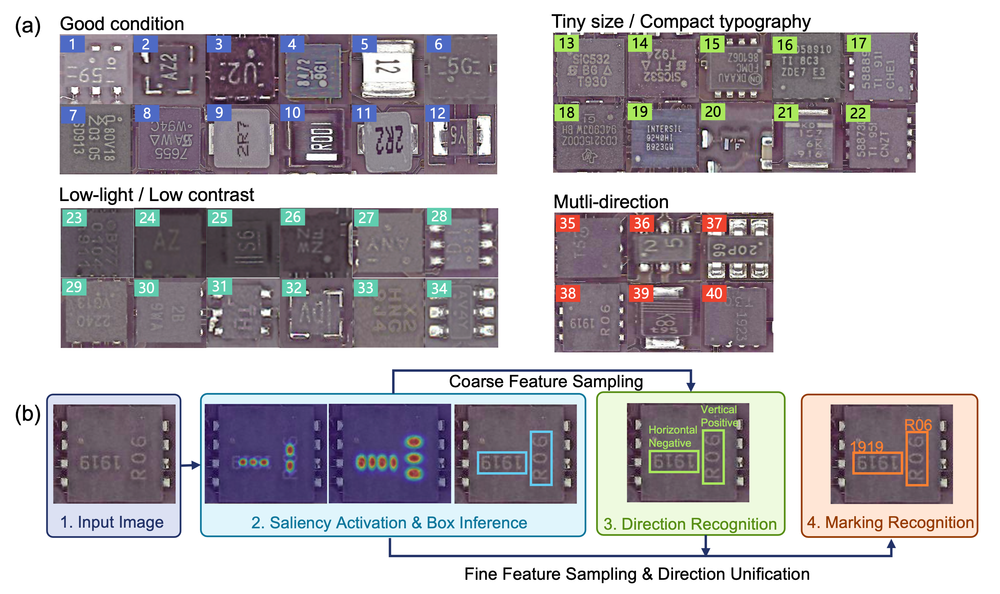

# ICMarkingNet
PyTorch implementation paper: ICMarkingNet: An Ultra-Fast and Streamlined Deep Model for IC Marking Inspection


## Setup

- Ensure that PyTorch with CUDAToolKit is set up in your environment. Note the version of CUDA should match the version for compling the PyTorch.
    - Python ≥ 3.7
    - PyTorch ≥ 1.7.0
    - Torchvision ≥ 0.8
- Install and compile cc_Torch:
  - Clone the cc_torch repo:                  
    ```bash
     cd ICMarkingNet
     git clone https://github.com/zsef123/Connected_components_PyTorch.git
     ```
  - Compile cc_torch
     ```bash
     cd Connected_components_PyTorch
     python setup.py install
     ```
  - Test if it is available:
    ```bash
    python setup.py test
    ```
- Install the required libraries:
  > imageio  
  > opencv-python  
  > scikit-image  
  > Polygon3  
  > yacs  
  > editdistance  
  > pillow   
  
  The below libraries are listed in `requirements.txt`, and can be also installed through pip:
  ```bash
  pip install -r requirement.txt
  ```


## Configuration

- Configure settings and hyper-parameters using the provided YAML file, `config.yaml`. For a comprehensive list of configurable items, refer to `utils/default_config.py`.
- For the checkpoint file, please refer to: [](https://drive.google.com/file/d/1fq4yzjUbWDV7e3s3CVJjN2un3auAZ_wr/view?usp=share_link).
- The test dataset can be downloaded from: [Test Dataset Link].
- After loading the checkpoint and data into the environment, update their paths in the configuration file.

## Testing and Training

- To run tests:
  ```bash
  python test.py -c config.yaml
  ```
- To train the model:
  ```bash
  python train.py -c config.yaml
  ```